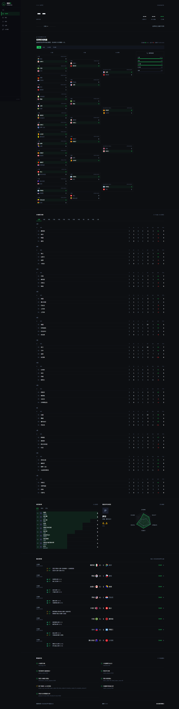
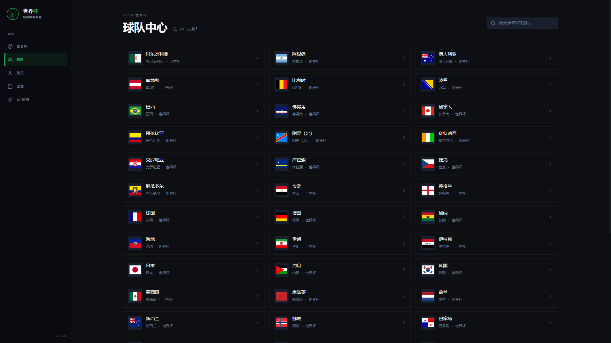
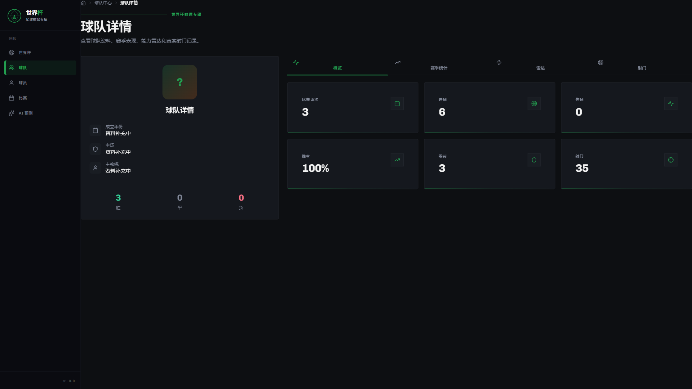
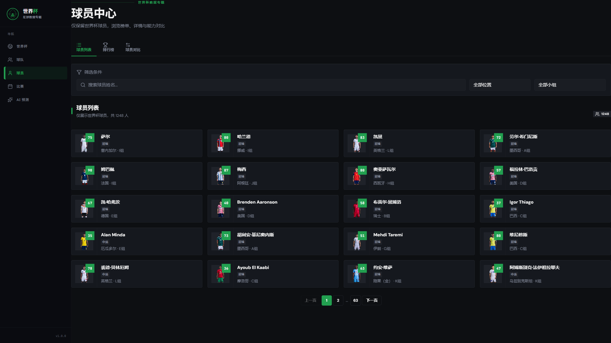
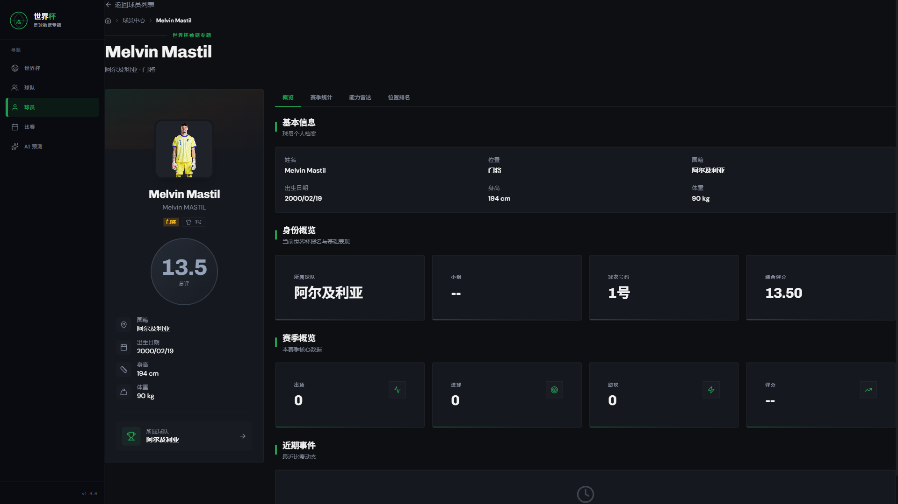
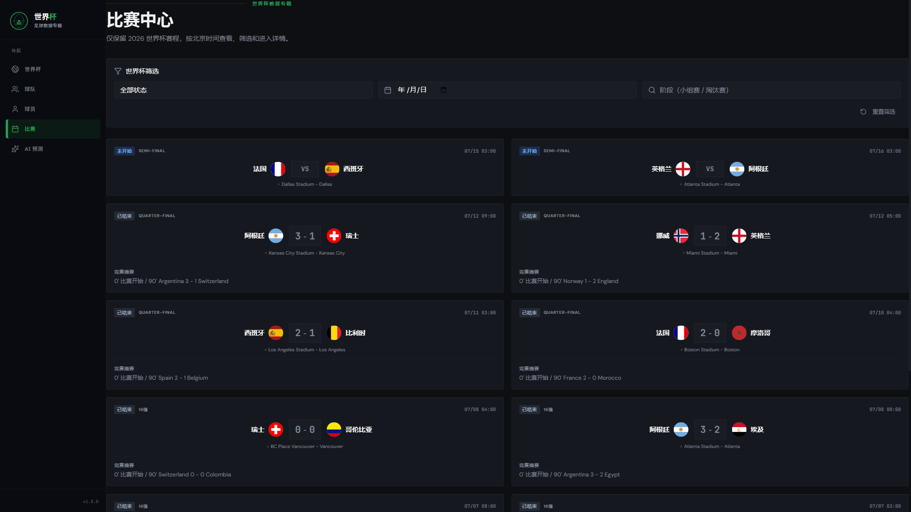
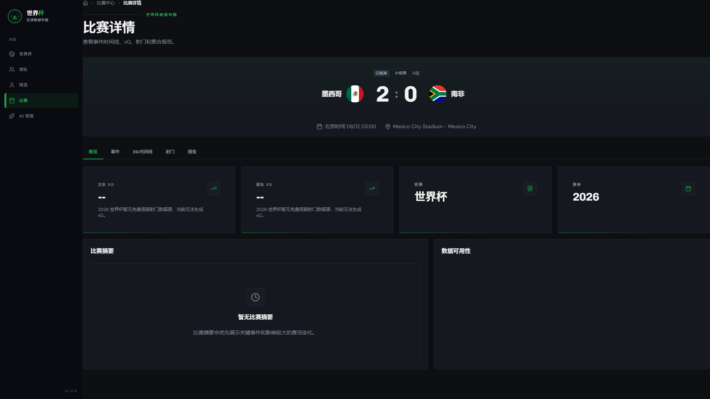
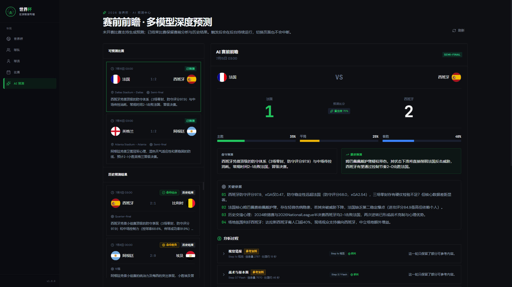

<p align="center">
  
</p>

<h1 align="center">⚽ 多源体育赛事数据采集与智能分析平台</h1>

<p align="center">
  <b>从 10+ 原始数据源到 AI 比赛预测 —— 一条面向 <code>2026 FIFA 世界杯</code> 的完整足球数据工程管道</b>
</p>

<p align="center">
  <a href="http://118.126.102.143:4173/worldcup"></a>
  <a href="http://118.126.102.143:8000/docs"></a>
</p>

<p align="center">
  
  
  
  
  
  
  
  
  
</p>

<p align="center">
  <a href="#项目背景">项目背景</a> •
  <a href="#核心能力">核心能力</a> •
  <a href="#系统架构">系统架构</a> •
  <a href="#功能演示">功能演示</a> •
  <a href="#ai-预测引擎">AI 预测</a> •
  <a href="#深度分析图表">分析图表</a> •
  <a href="#api-接口">API 接口</a> •
  <a href="#快速开始">快速开始</a>
</p>

---

## 项目背景

体育数据分散在 FIFA 官网、第三方 API、HTML 爬取页面、开放数据集等数十个异构来源中——**格式各异、更新频率不同、反爬策略千差万别**。大多数开源项目只解决了其中一环。

本项目试图回答一个问题：**如何从零搭建一条端到端的体育数据管道**——从网页抓取、数据清洗治理、结构化存储，到分析建模、AI 预测、实时推送与可视化展示？

技术栈覆盖 **Python**（FastAPI + SQLAlchemy + pandas）、**React 19**（TypeScript + Zustand + React Query）、**MySQL + Redis + Hadoop HDFS**，以及大模型双模型集成。

---

## 核心能力

<table>
<tr>
  <td width="33%">

### 🔌 多源数据采集

- 10+ 数据源，API + HTML 双模式
- FIFA、API-Football、FBref、Understat、StatsBomb 等
- 自动重试 + 指数退避（最多 5 次，上限 30s）
- User-Agent 轮换 + SHA-256 内容去重

  </td>
  <td width="33%">

### 🧹 六层数据清洗

1. 字段映射与标准化
2. 实体解析与对齐
3. 内容去重
4. 缺失值智能填补
5. 异常值检测（Z-Score + IQR + 规则）
6. 多源数据融合

  </td>
  <td width="33%">

### 📊 深度分析

- 球队进攻/防守综合评分
- 球员五维能力雷达图
- 预期进球（xG）时间线
- 小组竞争激烈程度
- 关键事件影响力量化

  </td>
</tr>
<tr>
  <td width="33%">

### 🤖 AI 预测引擎

- 双模型编排（阶跃星辰 + DeepSeek V4）
- 4 轮分析：战术 → 场外 → 深度推理 → 综合裁决
- Firecrawl 实时情报联网搜索
- 阵容图片视觉分析（多模态）

  </td>
  <td width="33%">

### ⚡ 实时推送

- WebSocket 直播比分（心跳保活）
- 30 秒定时轮询比赛事件
- 赛后自动刷新球员数据
- Redis Pub/Sub 支持水平扩展

  </td>
  <td width="33%">

### 🗄️ 分层存储

- **MySQL 8.0** — 结构化分析结果
- **Redis** — 缓存 + 实时直播数据
- **Hadoop HDFS** — 原始采集数据归档

  </td>
</tr>
</table>

---

## 系统架构

```
                            数据源 (10+)
         FIFA · API-Football · FBref · Understat · 懂球帝 · StatsBomb · ...
         ┌────────────────────────────────────────────────────────────┐
         │  BaseCrawler: 重试 · 反爬 · U-A 轮换 · SHA-256 去重 · HDFS  │
         └──────────────────────────────┬─────────────────────────────┘
                                        ▼
         ┌────────────────────────────────────────────────────────────┐
         │  清洗管线: 映射 → 解析 → 去重 → 填补 → 检测 → 融合           │
         └──────────────────────────────┬─────────────────────────────┘
                                        ▼
         ┌──────────────┬──────────────┬────────────────────────────┐
         │   MySQL 8    │   Redis 7    │    Hadoop HDFS 3.3         │
         └──────────────┴──────────────┴────────────────────────────┘
                                        ▼
         ┌───────────────────────────────────────────────────────────┐
         │  分析层:  球队评分 · 球员雷达 · xG · 事件影响 · AI 双模型预测  │
         └──────────────────────────────┬────────────────────────────┘
                                        ▼
         ┌───────────────────────────────────────────────────────────┐
         │  服务层:  FastAPI REST  ·  WebSocket  ·  APScheduler       │
         └──────────────────────────────┬────────────────────────────┘
                                        ▼
         ┌───────────────────────────────────────────────────────────┐
         │  前端:  React 19 · ECharts 5 · Tailwind CSS · Zustand     │
         └───────────────────────────────────────────────────────────┘
```

---

## 功能演示

以下截图均取自生产环境实时数据：

### 赛事大屏（世界杯总览）

> 小组积分榜 · 进球趋势 · 射手榜 · 攻防效率分布

| [](http://118.126.102.143:4173/worldcup) |
|:---:|
| 世界杯核心指标一览：进球数、比赛数、球队数、xG、射手榜 Top 10、小组积分榜 |

### 球队中心

> 球队列表筛选 · 近期战绩 · 核心球员 · 场均指标

| 球队列表 | 球队详情 |
|:---:|:---:|
| [](http://118.126.102.143:4173/teams) | [](http://118.126.102.143:4173/teams/24) |

### 球员中心

> 球员目录检索 · 五维雷达图 · 赛季数据 · 表现对比

| 球员列表 | 球员详情 |
|:---:|:---:|
| [](http://118.126.102.143:4173/players) | [](http://118.126.102.143:4173/players/1) |

### 比赛中心

> 赛程与赛果 · 比赛时间线 · 阵容可视化 · 统计对比

| 比赛列表 | 比赛详情 |
|:---:|:---:|
| [](http://118.126.102.143:4173/matches) | [](http://118.126.102.143:4173/matches/1521) |

### AI 预测中心

> 4 轮多模型分析 · 概率预测 · Mermaid 思维导图 · 多轮推理链回溯

| [](http://118.126.102.143:4173/ai-predict) |
|:---:|
| AI 预测结果展示：战术/场外/推理/裁决轮分析卡片、胜/平/负概率、预测比分、Mermaid 思维导图 |

---

## AI 预测引擎

预测引擎采用 **4 轮多模型编排** 架构，结合两个 LLM、实时联网情报与视觉分析：

```
┌──────────────────────────────────────────────────────────────────┐
│                      预测编排器 (Orchestrator)                    │
│                                                                    │
│  Round 0 — 视觉分析 (step-1o-turbo-vision, 阵容图片理解)           │
│                ↓                                                   │
│  Round 1 — 战术分析 (step-3.7-flash) ──┐                         │
│  Round 2 — 场外微观 (step-3.7-flash) ──┤ （并行执行）             │
│                ↓                         ↓                         │
│  Round 3 — 深度推理 (deepseek-v4-flash, 100万上下文窗口)          │
│                ↓                                                   │
│  Round 4 — 综合裁决 (deepseek-v4-flash)                          │
│                ↓                                                   │
│  JSON 修复链 → 写入 match_predictions 表                          │
└──────────────────────────────────────────────────────────────────┘
```

| 组件 | 模型 | 职责 |
|------|------|------|
| 战术轮 | `step-3.7-flash` | 球队阵型、战术模式、定位球分析 |
| 场外轮 | `step-3.7-flash` | 球员状态、伤停、天气、媒体舆论 |
| 推理轮 | `deepseek-v4-flash` | 综合多轮先验输出深度分析（100 万 token 上下文） |
| 裁决轮 | `deepseek-v4-flash` | 最终裁决 + 置信度校准 |
| 视觉轮 | `step-1o-turbo-vision` | 阵容图/阵型图的视觉理解 |
| 联网搜索 | Firecrawl Search API | 实时新闻、采访、伤停更新 |

### JSON 修复链

LLM 输出经过多级修复管道：**平衡 JSON 提取** → **激进候选扫描** → **语义修复重试** → **Mermaid 思维导图兜底**，确保最终结果结构化可用。

---

## 深度分析图表

系统对 2026 世界杯进行了全维度量化分析，以下为部分代表性输出（完整 16 张见 [`export/ppt_charts/`](export/ppt_charts/)）：

### 数据管道可视化

| 多源异构采集架构 | 六层清洗流水线 | 异常值智能检测 |
|:---:|:---:|:---:|
| 10+ 数据源统一接入 | 字段映射→解析→去重→填补→检测→融合 | Z-Score + IQR + 规则三法并行 |
|  |  |  |

| 数据源覆盖能力矩阵 | 采集规模与时效性 | 多源数据融合效果 |
|:---:|:---:|:---:|
| API · HTML · 开放数据三类覆盖 | 总量、覆盖率、新鲜度分布 | FBref + Understat + API-Football 对比 |
|  |  |  |

### 世界杯分析成果

| 小组积分榜总览 | 小组竞争激烈程度 | 射手榜 Top 10 |
|:---:|:---:|:---:|
| 48 队 12 组实时排名 | 每组竞争激烈度指数 | 进球王 + 转化率 |
|  |  |  |

| 球队攻防四象限 | 巨星五维雷达对比 | 球员能力矩阵 Top 20 |
|:---:|:---:|:---:|
| 进攻效率 vs 防守稳固性 | 梅西·姆巴佩·贝林厄姆等核心能力对比 | 跨位置综合排名 |
|  |  |  |

### 进阶分析

| 各位置球员表现分布 | xG 预期进球时间线 | 关键事件影响力量化 |
|:---:|:---:|:---:|
| 门将·后卫·中场·前锋多维分布 | 各队 xG 动态演变 | 进球/红牌等事件的数值化影响 |
|  |  |  |

| AI 预测准确率分析 |
|:---:|
| 多模型 vs 单模型命中率对比 |
|  |

---

## API 接口

所有接口挂载于 `/api/v1/` 前缀下，访问 `/docs` 查看交互式 Swagger UI。

<details>
<summary><b>📊 世界杯小组积分榜</b> — <code>GET /api/v1/worldcup/summary</code></summary>

```bash
curl http://localhost:8000/api/v1/worldcup/summary
```

```json
{
  "league": "世界杯",
  "season": "2026",
  "group_count": 12,
  "match_count": 102,
  "qualified_team_count": 32,
  "groups": [
    {
      "group": "A",
      "standings": [
        { "rank": 1, "team": "摩洛哥", "played": 3, "won": 2, "points": 7 },
        { "rank": 2, "team": "西班牙", "played": 3, "won": 2, "points": 6 }
      ]
    }
  ]
}
```
</details>

<details>
<summary><b>🤖 触发 AI 预测</b> — <code>POST /api/v1/predict/matches/{id}/trigger</code></summary>

```bash
# sync=true 等待结果返回（最长约 3 分钟）
curl -X POST 'http://localhost:8000/api/v1/predict/matches/2308/trigger?sync=true'
```

```json
{
  "match_id": 2308,
  "status": "completed",
  "home_win_prob": 35.0,
  "draw_prob": 25.0,
  "away_win_prob": 40.0,
  "predicted_home_score": 1,
  "predicted_away_score": 2,
  "confidence": 75.0,
  "conservative_verdict": "保守结论...",
  "aggressive_verdict": "激进结论...",
  "key_reasons": ["依据 1", "依据 2", "依据 3"],
  "mermaid_mindmap": "```mermaid\nmindmap\n  root((...))\n```"
}
```
</details>

<details>
<summary><b>🕷️ 手动触发数据采集</b> — <code>POST /api/v1/crawl/trigger</code></summary>

```bash
curl -X POST http://localhost:8000/api/v1/crawl/trigger \
  -H "Content-Type: application/json" \
  -d '{
    "source": "fifa_official",
    "target": "standings",
    "league_name": "世界杯",
    "season_name": "2026"
  }'
```
</details>

<details>
<summary><b>📋 其他常用接口</b></summary>

| 方法 | 路径 | 说明 |
|------|------|------|
| GET | `/api/v1/predict/status` | 预测模块就绪检查 |
| GET | `/api/v1/predict/matches` | 查询已有预测的比赛列表 |
| GET | `/api/v1/worldcup/matches` | 世界杯赛程与结果列表 |
| GET | `/api/v1/players` | 球员分析数据（含雷达图） |
| GET | `/api/v1/teams` | 球队攻防象限评分 |
| WebSocket | `/ws/live` | 直播比分实时推送 |
</details>

---

## 数据源

按接入方式分类：

| 类型 | 数据源 | 覆盖内容 |
|------|--------|----------|
| **结构化 API** | FIFA Official · API-Football · Football-Data · TheSportsDB · OpenLigaDB | 赛程 / 赛果 / 积分榜 / 球队阵容 |
| **HTML 爬取** | FBref · Understat · 懂球帝 · TeamRankings · Fotmob | xG / 高级统计 / 射门事件 / 中文赛果 |
| **开放数据** | StatsBomb Open Data | 细粒度比赛事件（传球 / 射门 / 压迫） |

所有采集器统一继承 `BaseCrawler`：内置重试（最多 5 次 + 指数退避上限 30s）、User-Agent 轮换、SHA-256 内容去重，可选 HDFS 原始数据归档。

---

## 技术栈

| 分层 | 技术 |
|------|------|
| **后端** | `FastAPI` · `SQLAlchemy` · `pandas` · `scikit-learn` · `APScheduler` · `python-dotenv` |
| **前端** | `React 19` · `TypeScript` · `Vite 6` · `ECharts 5` · `Tailwind CSS` · `Zustand` · `@tanstack/react-query` |
| **存储** | `MySQL 8.0` · `Redis 7` · `Hadoop HDFS 3.3` |
| **AI / LLM** | `step-3.7-flash` · `deepseek-v4-flash` · `step-1o-turbo-vision` · `Firecrawl` |
| **部署** | `docker-compose` · `nginx` · `systemd` |

---

## 项目结构

```
football-data-analysis-platform/
├── backend/                           # FastAPI 后端（入口: app/main.py）
│   └── app/
│       ├── api/                       # REST 接口 — 10 个模块
│       │   ├── worldcup.py            #   世界杯大屏接口
│       │   ├── predict.py             #   AI 预测触发/查询
│       │   ├── crawl.py               #   手动采集触发
│       │   ├── players.py             #   球员分析
│       │   └── ...                    #   teams / matches / leagues / live / ...
│       ├── crawlers/                  # 10+ 数据源采集器
│       ├── cleaning/                  # 六层数据清洗管线
│       ├── analysis/                  # 分析模型
│       │   ├── team_analysis.py       #   球队攻防评分
│       │   ├── player_analysis.py     #   球员五维雷达
│       │   ├── xg_model.py            #   预期进球聚合
│       │   └── event_impact.py        #   关键事件影响量化
│       ├── prediction/                # AI 双模型预测
│       │   ├── orchestrator.py        #   4 轮编排引擎
│       │   ├── llm_client.py          #   StepFun + DeepSeek API 客户端
│       │   ├── prompts.py             #   各轮 Prompt 模板
│       │   ├── context_builder.py     #   比赛上下文组装（从 DB 读取）
│       │   ├── web_search.py          #   Firecrawl 实时搜索
│       │   └── media.py               #   图片视觉分析
│       ├── models/                    # SQLAlchemy ORM 定义
│       ├── scheduler/                 # APScheduler 定时任务
│       ├── services/                  # 业务逻辑层
│       └── main.py                    # FastAPI App + CORS + 中间件
├── frontend/                          # React 前端
│   └── src/
│       ├── pages/                     # 路由页面（dashboard / players / predict / ...）
│       ├── components/                # 通用 UI 组件
│       ├── api/                       # Axios 请求封装
│       ├── stores/                    # Zustand 状态切片
│       └── types/                     # TypeScript 类型定义
├── scripts/                           # 工具脚本（FIFA 数据导入、PPT 图表生成等）
├── export/                            # 生成图表与示例数据
│   ├── ppt_charts/                    # 16 张分析可视化图表 (PNG)
│   └── screenshots/                   # 前端页面截图 (PNG)
├── .env.example                       # 环境变量模板
└── deploy.sh                          # 生产部署脚本
```

---

## 快速开始

### 环境要求

| 依赖 | 版本 |
|------|------|
| Python | ≥ 3.9 |
| Node.js | ≥ 18 |
| MySQL | ≥ 8.0 |
| Redis | ≥ 6 |
| Hadoop（可选） | 3.3.6（需 OpenJDK 1.8） |

### 1. 克隆 & 配置

```bash
git clone https://github.com/htt-FAK/football-data-analysis-platform.git
cd football-data-analysis-platform
```

### 2. 启动后端

```bash
cd backend
cp ../.env.example .env
# 编辑 .env 填入数据库、Redis、AI API Key 等配置
pip install -r requirements.txt
uvicorn app.main:app --reload --host 0.0.0.0 --port 8000
```

### 3. 启动前端

```bash
cd frontend
npm install
npm run dev
```

### 访问地址

| 服务 | 地址 |
|------|------|
| 前端页面 | http://localhost:5173 |
| API 文档（Swagger） | http://localhost:8000/docs |
| 世界杯大屏 | http://localhost:5173/worldcup |

### 环境变量说明

复制 `.env.example` 后按需填入：

| 变量名 | 必填 | 说明 |
|--------|------|------|
| `DB_HOST` / `DB_PASSWORD` | ✅ | MySQL 连接 |
| `REDIS_HOST` | ❌ | Redis 连接（默认 localhost） |
| `STEPFUN_API_KEY` | AI 预测时必填 | [阶跃星辰](https://platform.stepfun.com/) API Key |
| `DEEPSEEK_API_KEY` | AI 预测时必填 | DeepSeek / 商汤日日新 API Key |
| `FIRECRAWL_API_KEY` | ❌ | [Firecrawl](https://firecrawl.dev) 联网搜索（有免费额度） |

---

## License

本项目为**课程设计与个人学习实践项目**，仅供学习、交流与作品展示使用。

---

<p align="center">
  <sub>从原始 HTML 到 AI 预测 —— 一条完整的足球数据工程管道。</sub>
</p>
