<p align="center">
  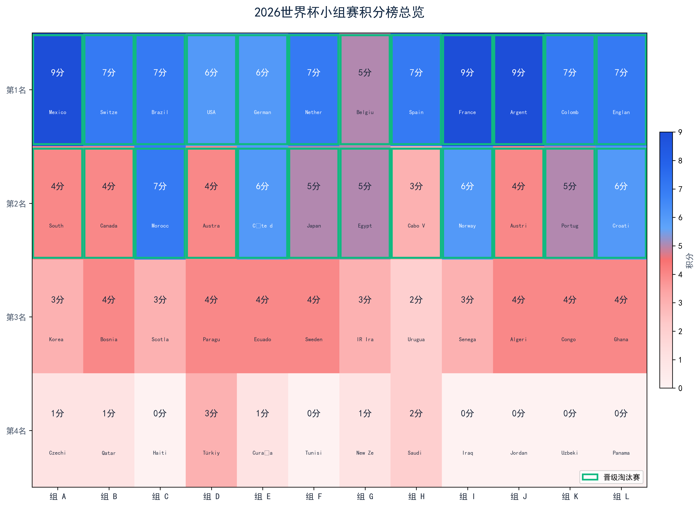
</p>

<h1 align="center">Multi-Source Sports Data Pipeline & AI Prediction Platform</h1>

<p align="center">
  <b>From 10+ raw data sources to AI-powered match predictions — a complete end-to-end football data engineering pipeline</b>
</p>

<p align="center">
  <a href="http://118.126.102.143:4173/worldcup"></a>
  <a href="http://118.126.102.143:8000/docs"></a>
</p>

<p align="center">
  
  
  
  
  
  
  
  
  
</p>

<p align="center">
  <a href="#features">Features</a> •
  <a href="#architecture">Architecture</a> •
  <a href="#data-sources">Data Sources</a> •
  <a href="#api">API</a> •
  <a href="#ai-prediction">AI Prediction</a> •
  <a href="#screenshots">Screenshots</a> •
  <a href="#quickstart">Quick Start</a>
</p>

---

## Why This Project

Sports data is scattered across FIFA's website, third-party APIs, HTML-scraped pages, and open datasets — each with different formats, update frequencies, and anti-scraping strategies. Most open-source projects tackle only one piece of this puzzle.

This project answers one question: **how do you build a complete end-to-end sports data pipeline from scratch** — covering web scraping, data cleansing, structured storage, analytical modeling, AI predictions, real-time push, and interactive visualization?

The tech stack spans **Python** (FastAPI + SQLAlchemy + pandas), **React 19** (TypeScript + Zustand + React Query), **MySQL + Redis + Hadoop HDFS**, and dual **LLM model** integration.

---

## Features

<table>
<tr>
  <td width="33%">

### 🔌 Multi-Source Ingestion

- **10+ data sources** with API + HTML dual-mode crawling
- FIFA, API-Football, FBref, Understat, StatsBomb, and more
- Auto-retry with exponential backoff (up to 5 attempts, 30s ceiling)
- User-Agent rotation + SHA-256 deduplication

  </td>
  <td width="33%">

### 🧹 Six-Layer Cleansing

1. Field mapping & normalization
2. Entity resolution
3. Deduplication
4. Missing value imputation
5. Outlier detection (Z-Score + IQR + Rule-based)
6. Multi-source fusion

  </td>
  <td width="33%">

### 📊 Deep Analytics

- Team offense/defense scoring
- Player 5-dimension radar profiles
- Expected Goals (xG) timeline
- League competitiveness analysis
- Key event impact quantification

  </td>
</tr>
<tr>
  <td width="33%">

### 🤖 AI Prediction

- Dual-model orchestration (Step-3.7-Flash + DeepSeek V4)
- 4-round analysis: tactical → contextual → reasoning → arbiter
- Firecrawl real-time intelligence search
- Vision analysis on lineup/formation images

  </td>
  <td width="33%">

### ⚡ Real-Time Push

- WebSocket live scores with heartbeat
- 30-second polling for match events
- Post-match automatic player data refresh
- Redis pub/sub for horizontal scaling

  </td>
  <td width="33%">

### 🗄️ Tiered Storage

- **MySQL 8** — structured analytical results
- **Redis** — caching + real-time live data
- **Hadoop HDFS** — raw crawled data archival

  </td>
</tr>
</table>

---

## Architecture

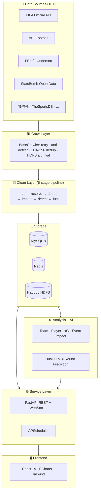

### Pipeline Overview

```
  Sources          Crawl       Clean          Store        Analysis       Serve        UI
┌───────┐     ┌──────────┐  ┌───────┐  ┌──────────────┐  ┌─────────┐  ┌───────┐  ┌─────────┐
│ FIFA  │     │  Retry   │  │ Map   │  │  MySQL 8     │  │ Scores  │  │ REST  │  │ React19 │
│ FBref │────▶│  Backoff │─▶│Fusion │─▶│  Redis       │─▶│ xG      │─▶│  WS   │─▶│ ECharts │
│ Stats │     │  U-A rot. │  │Detect │  │  Hadoop HDFS │  │ AI Pred │  │ Sched │  │ Zustand │
└───────┘     └──────────┘  └───────┘  └──────────────┘  └─────────┘  └───────┘  └─────────┘
```

---

## Data Sources

Organized by ingestion method:

| Category | Sources | Coverage |
|----------|---------|----------|
| **Structured APIs** | FIFA Official · API-Football · Football-Data · TheSportsDB · OpenLigaDB | Schedules / results / standings / squad rosters |
| **HTML Scraping** | FBref · Understat · 懂球帝 · TeamRankings · Fotmob | xG / advanced stats / shot events / Chinese-language results |
| **Open Data** | StatsBomb Open Data | Granular match events (passes, shots, presses) |

All crawlers inherit from `BaseCrawler` — providing unified retry (3–5 attempts with exponential backoff), User-Agent rotation, SHA-256 content dedup, and optional HDFS raw-data archival.

---

## AI Prediction

The prediction engine runs a **4-round multi-model orchestration** combining two LLMs with real-time web intelligence and vision analysis:

```
┌─────────────────────────────────────────────────────────────────┐
│                    Prediction Orchestrator                       │
│                                                                  │
│  Round 0 ─ Vision Analysis (step-1o-turbo-vision)               │
│               ↓                                                  │
│  Round 1 ─ Tactical Analysis  (step-3.7-flash) ──┐              │
│  Round 2 ─ Contextual Micro   (step-3.7-flash) ──┤ parallel    │
│               ↓                                    ↓              │
│  Round 3 ─ Deep Reasoning     (deepseek-v4-flash, 1M ctx)       │
│               ↓                                                  │
│  Round 4 ─ Arbiter / Verdict  (deepseek-v4-flash)               │
│               ↓                                                  │
│  → JSON repair chain → Persist to DB                            │
└─────────────────────────────────────────────────────────────────┘
```

| Component | Model | Role |
|-----------|-------|------|
| Tactical Round | `step-3.7-flash` | Team formation, tactical patterns, set-piece analysis |
| Contextual Round | `step-3.7-flash` | Player form, injuries, weather, media coverage |
| Reasoning Round | `deepseek-v4-flash` | Deep synthesis across all prior rounds (1M context window) |
| Arbiter Round | `deepseek-v4-flash` | Final verdict with confidence calibration |
| Vision Round | `step-1o-turbo-vision` | Lineup photo & formation diagram understanding |
| Web Search | Firecrawl API | Real-time news, interviews, injury updates |

### JSON Repair Chain

LLM outputs go through a multi-stage repair pipeline: balanced JSON extraction → aggressive candidate scanning → semantic repair retry → Mermaid mindmap fallback.

---

## API

All endpoints are served under `/api/v1/`. Interactive Swagger UI available at `/docs`.

<details>
<summary><b>📊 GET /api/v1/worldcup/summary</b> — Group standings overview</summary>

```bash
curl http://localhost:8000/api/v1/worldcup/summary
```

```json
{
  "league": "世界杯",
  "season": "2026",
  "group_count": 12,
  "match_count": 102,
  "groups": [
    {
      "group": "A",
      "standings": [
        { "rank": 1, "team": "摩洛哥", "played": 3, "won": 2, "points": 7 },
        { "rank": 2, "team": "西班牙", "played": 3, "won": 2, "points": 6 }
      ]
    }
  ]
}
```
</details>

<details>
<summary><b>🤖 POST /api/v1/predict/matches/{id}/trigger</b> — Trigger AI prediction</summary>

```bash
curl -X POST 'http://localhost:8000/api/v1/predict/matches/2308/trigger?sync=true'
```

```json
{
  "match_id": 2308,
  "status": "completed",
  "home_win_prob": 35.0,
  "draw_prob": 25.0,
  "away_win_prob": 40.0,
  "predicted_home_score": 1,
  "predicted_away_score": 2,
  "confidence": 75.0,
  "conservative_verdict": "...",
  "key_reasons": ["...", "...", "..."],
  "mermaid_mindmap": "```mermaid\nmindmap\n  root((...)\n```"
}
```
</details>

<details>
<summary><b>🕷️ POST /api/v1/crawl/trigger</b> — Trigger data crawl</summary>

```bash
curl -X POST http://localhost:8000/api/v1/crawl/trigger \
  -H "Content-Type: application/json" \
  -d '{"source": "fifa_official", "target": "standings", "league_name": "世界杯", "season_name": "2026"}'
```
</details>

<details>
<summary><b>Other Key Endpoints</b></summary>

| Method | Endpoint | Description |
|--------|----------|-------------|
| GET | `/api/v1/predict/status` | Prediction module readiness check |
| GET | `/api/v1/predict/matches` | List all predicted matches |
| GET | `/api/v1/worldcup/matches` | World Cup match schedule + results |
| GET | `/api/v1/players` | Player analytics with radar profiles |
| GET | `/api/v1/teams` | Team offense/defense quadrant data |
| WS | `/ws/live` | WebSocket live score stream |
</details>

---

## Screenshots

### Data Pipeline Visualization

| Data Collection Architecture | Cleaning Pipeline | Outlier Detection |
|:---:|:---:|:---:|
| 10+ sources, API + HTML dual-mode | Map → Resolve → Dedup → Impute → Detect → Fuse | Z-Score + IQR + Rule-based parallel |
| 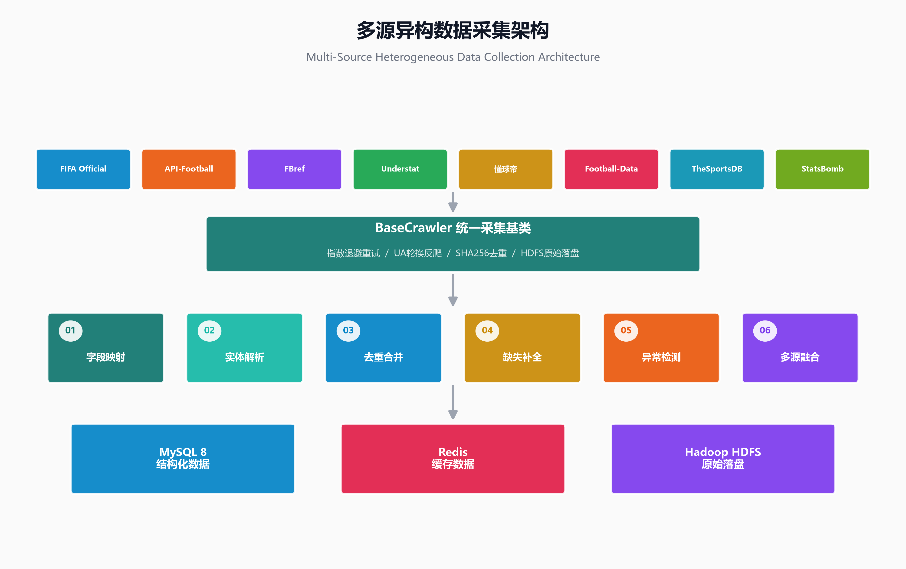 | 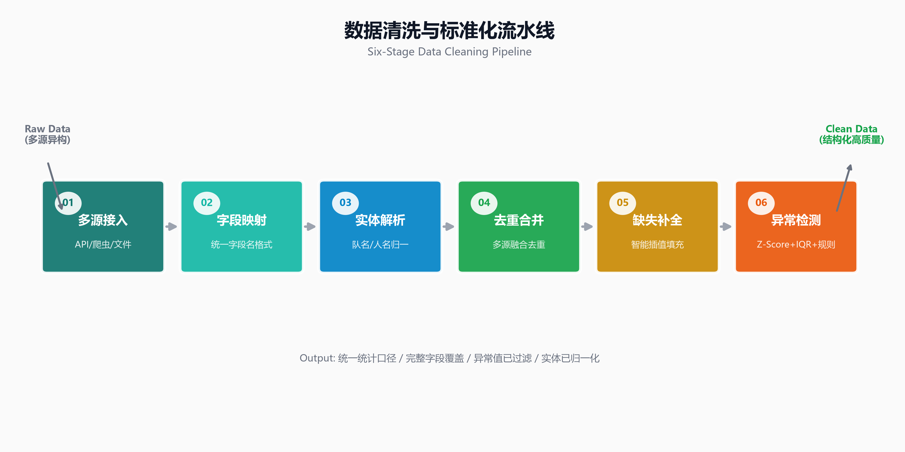 | 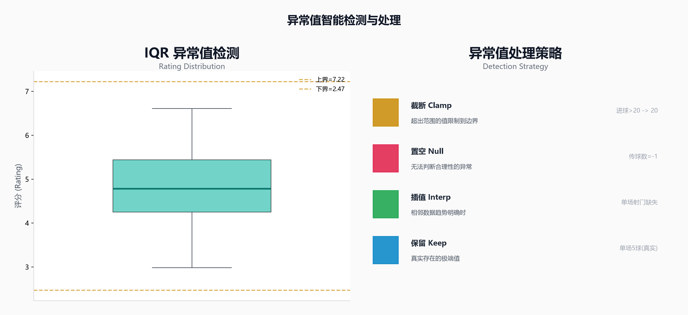 |

| Data Source Coverage | Collection Scale | Multi-Source Fusion |
|:---:|:---:|:---:|
| API · HTML · Open Data coverage matrix | Volume, freshness, granularity | FBref + Understat + API-Football merge |
| 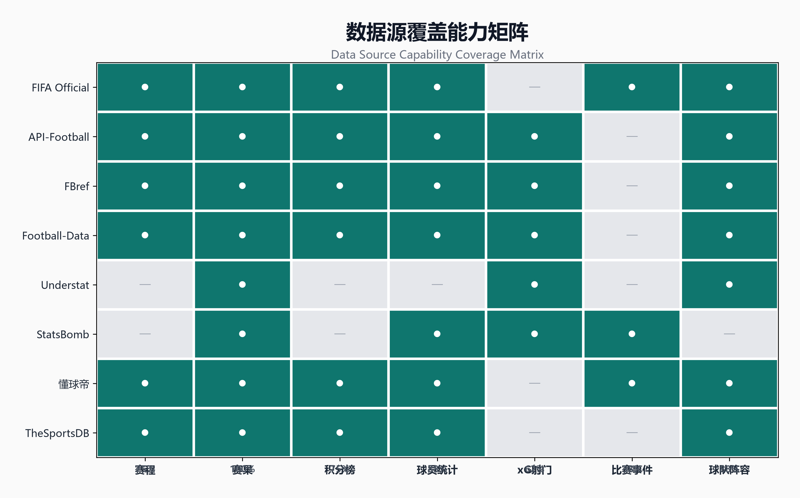 | 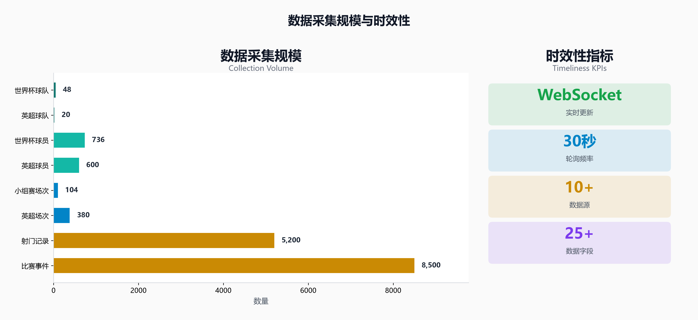 | 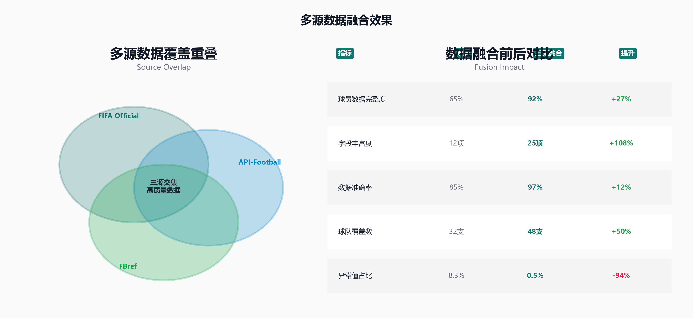 |

### World Cup Analytics

| Group Standings | Competitiveness | Goal Scoring Leaders |
|:---:|:---:|:---:|
| 48 teams across 12 groups | Tightness index per group | Top 10 scorers with conversion rates |
|  | 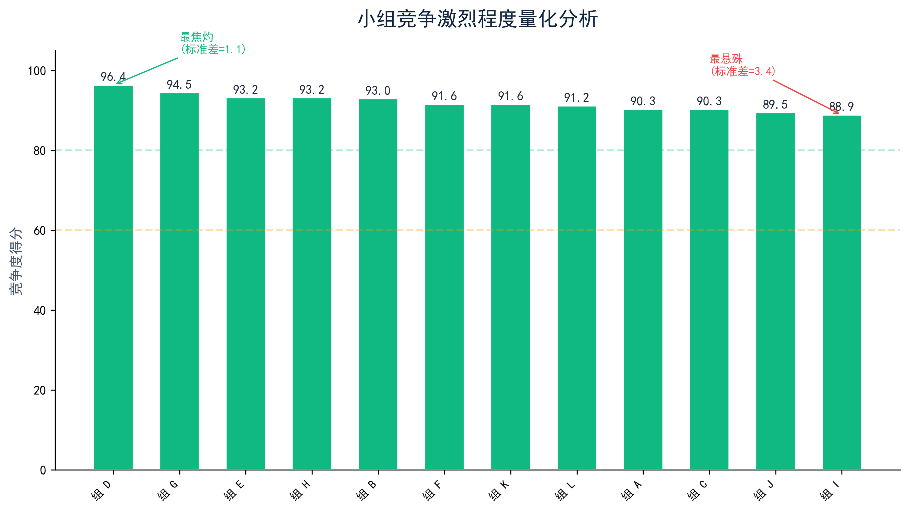 | 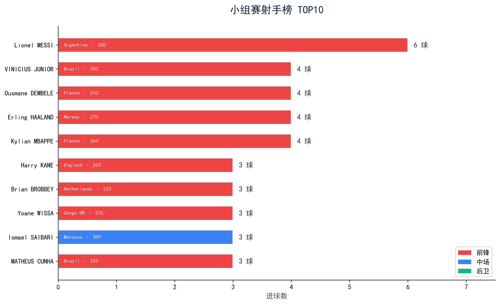 |

| Team Quadrant | Star Player Radar | Player Performance Matrix |
|:---:|:---:|:---:|
| Attack efficiency vs defense solidity | 5-dimension: attack · defense · stamina · technique · impact | TOP 20 across all positions |
| 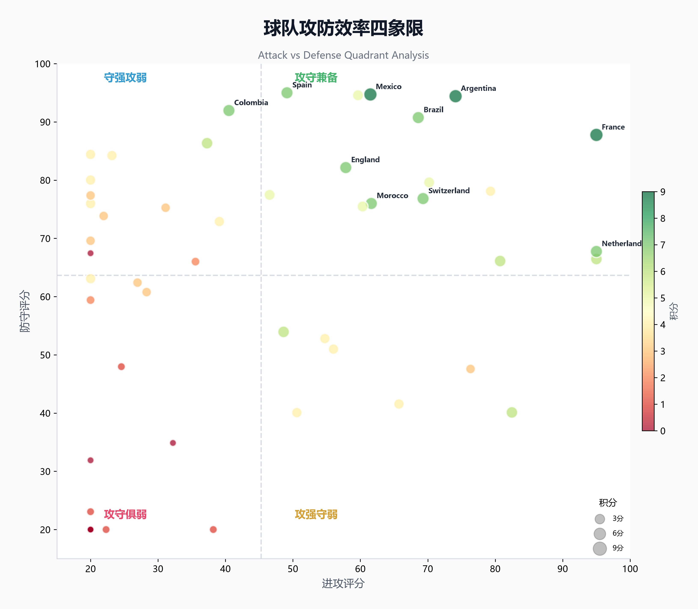 | 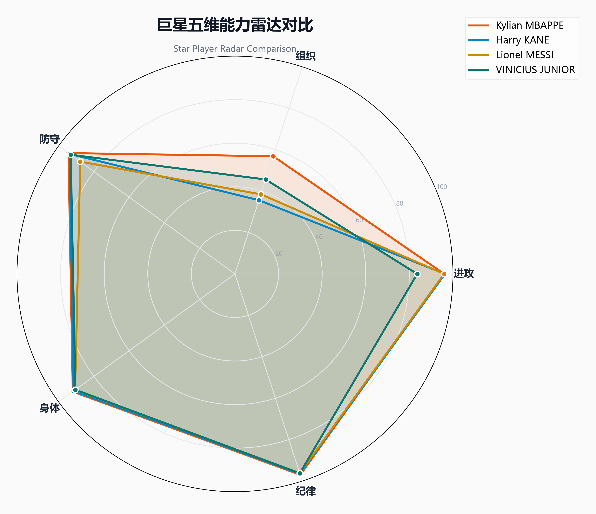 | 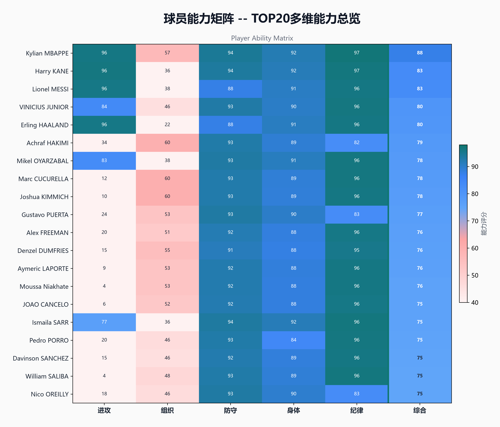 |

### Advanced Analytics

| Position Performance | xG Timeline | Key Event Impact |
|:---:|:---:|:---:|
| Distribution across GK · DEF · MID · FWD | Expected goals evolution per team | Quantified impact of goals/red cards |
| 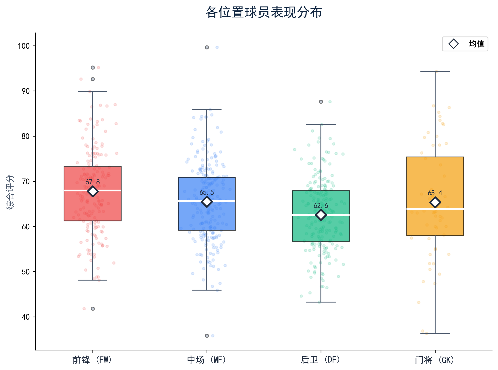 | 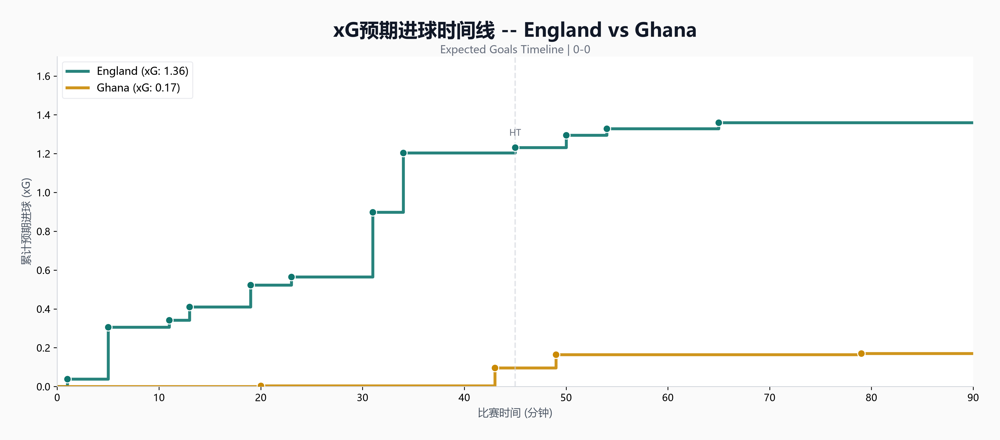 | 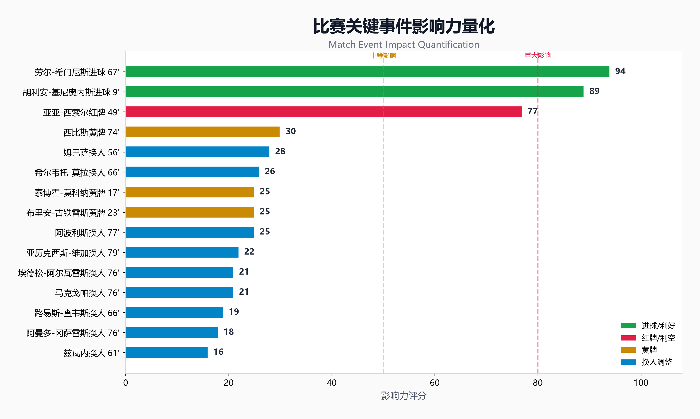 |

| Prediction Accuracy |
|:---:|
| Multi-model vs single-model hit rate comparison |
| 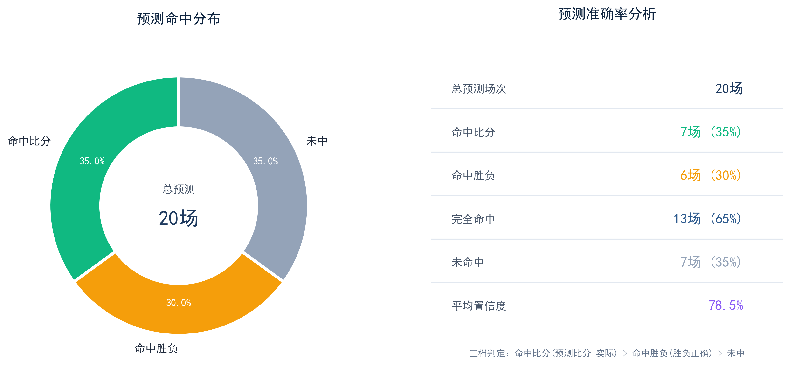 |

> All 16 analytics charts available in [`export/ppt_charts/`](export/ppt_charts/)

---

## Tech Stack

| Layer | Technologies |
|-------|-------------|
| **Backend** | `FastAPI` · `SQLAlchemy` · `pandas` · `scikit-learn` · `APScheduler` · `python-dotenv` |
| **Frontend** | `React 19` · `TypeScript` · `Vite 6` · `ECharts 5` · `Tailwind CSS` · `Zustand` · `@tanstack/react-query` |
| **Storage** | `MySQL 8.0` · `Redis 7` · `Hadoop HDFS 3.3` |
| **AI / LLM** | `step-3.7-flash` · `deepseek-v4-flash` · `step-1o-turbo-vision` · `Firecrawl` |
| **DevOps** | `docker-compose` · `nginx` · `systemd` |

---

## Project Structure

```
football-data-analysis-platform/
├── backend/                           # FastAPI backend (entry: app/main.py)
│   └── app/
│       ├── api/                       # REST routes — 10 modules
│       │   ├── worldcup.py            #   World Cup dashboard endpoints
│       │   ├── predict.py             #   AI prediction trigger/status
│       │   ├── crawl.py               #   Manual crawl triggers
│       │   ├── players.py             #   Player analytics
│       │   └── ...                    #   teams / matches / leagues / live / ...
│       ├── crawlers/                  # 10+ data source crawlers
│       ├── cleaning/                  # Six-layer cleansing pipeline
│       ├── analysis/                  # Analytical models
│       │   ├── team_analysis.py       #   Offense/defense quadrant scoring
│       │   ├── player_analysis.py     #   5-dimension radar profiles
│       │   ├── xg_model.py            #   Expected goals aggregation
│       │   └── event_impact.py        #   Key event effect quantification
│       ├── prediction/                # AI dual-model prediction
│       │   ├── orchestrator.py        #   4-round orchestration engine
│       │   ├── llm_client.py          #   StepFun + DeepSeek API clients
│       │   ├── prompts.py             #   Round-specific prompt templates
│       │   ├── context_builder.py     #   Match context assembly from DB
│       │   ├── web_search.py          #   Firecrawl real-time search
│       │   └── media.py               #   Vision analysis on images
│       ├── models/                    # SQLAlchemy ORM definitions
│       ├── scheduler/                 # APScheduler cron jobs
│       ├── services/                  # Business logic layer
│       └── main.py                    # App + CORS + middleware setup
├── frontend/                          # React frontend
│   └── src/
│       ├── pages/                     # Route pages (dashboard, players, predict, ...)
│       ├── components/                # Shared UI components
│       ├── api/                       # Axios request wrappers
│       ├── stores/                    # Zustand state slices
│       └── types/                     # TypeScript type definitions
├── scripts/                           # Utility scripts (FIFA import, chart generation)
├── export/                            # Generated charts and sample data
│   └── ppt_charts/                    # 16 analytics visualizations (PNG)
├── .env.example                       # Environment variable template
└── deploy.sh                          # Production deployment script
```

---

## Quick Start

### Prerequisites

| Requirement | Version |
|-------------|---------|
| Python | ≥ 3.9 |
| Node.js | ≥ 18 |
| MySQL | ≥ 8.0 |
| Redis | ≥ 6 |
| Hadoop (optional) | 3.3.6 (OpenJDK 1.8) |

### 1. Clone & Configure

```bash
git clone https://github.com/htt-FAK/football-data-analysis-platform.git
cd football-data-analysis-platform
```

### 2. Backend

```bash
cd backend
cp ../.env.example .env
# Edit .env with your database, Redis, and AI API keys
pip install -r requirements.txt
uvicorn app.main:app --reload --host 0.0.0.0 --port 8000
```

### 3. Frontend

```bash
cd frontend
npm install
npm run dev
```

### Endpoints

| Service | URL |
|---------|-----|
| Frontend | http://localhost:5173 |
| API Docs (Swagger) | http://localhost:8000/docs |
| World Cup Dashboard | http://localhost:5173/worldcup |

### Environment Variables

Copy `.env.example` and fill in:

| Variable | Required | Description |
|----------|----------|-------------|
| `DB_HOST` / `DB_PASSWORD` | ✅ | MySQL connection |
| `REDIS_HOST` | ❌ | Redis connection (default: localhost) |
| `STEPFUN_API_KEY` | For AI prediction | [StepFun](https://platform.stepfun.com/) API key |
| `DEEPSEEK_API_KEY` | For AI prediction | DeepSeek / SenseNova API key |
| `FIRECRAWL_API_KEY` | Optional | [Firecrawl](https://firecrawl.dev) search (free tier available) |

---

## License

This project is built as a **capstone design and learning exercise**. Available for educational, academic, and portfolio demonstration purposes.

---

<p align="center">
  <sub>From raw HTML to AI predictions — a complete end-to-end sports data engineering pipeline.</sub>
</p>
